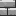
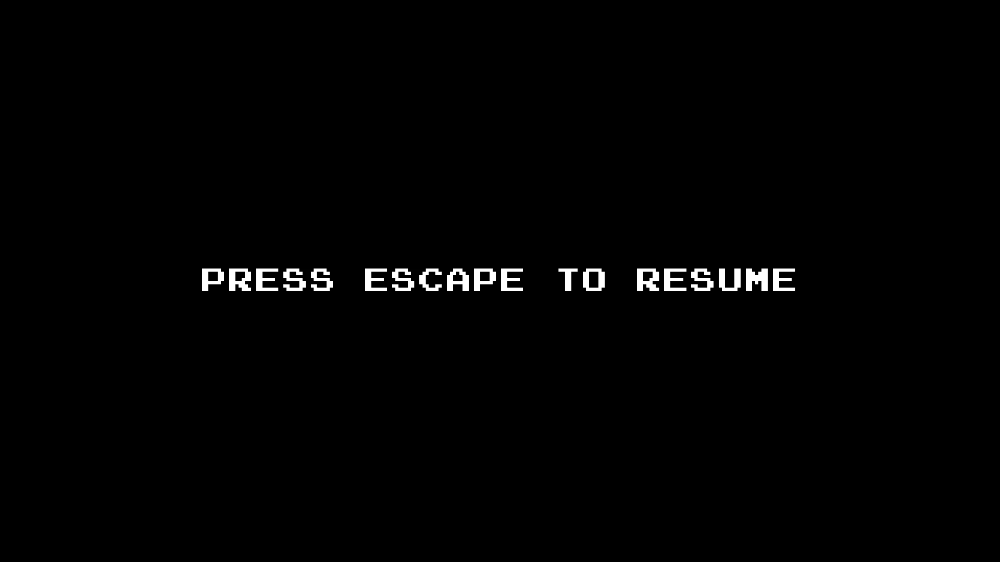

<h1 align=center> COM-119 2024F Project: simple-platformer-project </h1>

<h5 align=center>This is a simple project for the Introduction to Programming course at AUCA</h5>

**simple-platformer-project** is a raylib-based game that challenges the students of the Introduction to Programming course and requires them to showcase the knowledge they have obtained throughout the semester.

<h2 align=center> Features </h2>

The layout of every level of is designed specifically to be as simple as possible. If features:

|                Image                 | Sprite | Description      |
|:------------------------------------:|:------:|:-----------------|
|         |  Air   | Self-explanatory |
|        |  Wall  | Self-explanatory |
|  |  Exit  | Self-explanatory |

##### The Main Menu Screen

Pressing `Enter` will start the game.

##### The Game Screen

The player can move the `Knight` with `W A D`, `Space`, or `Arrows`.

##### The Pause Screen

The player can enter and quit the `Pause screen` by pressing `Esc`.

##### The Endings

The `Ending` occurs by the end of `Level 3`.

---
<h5 align=center> by @lunamaltseva </h5>